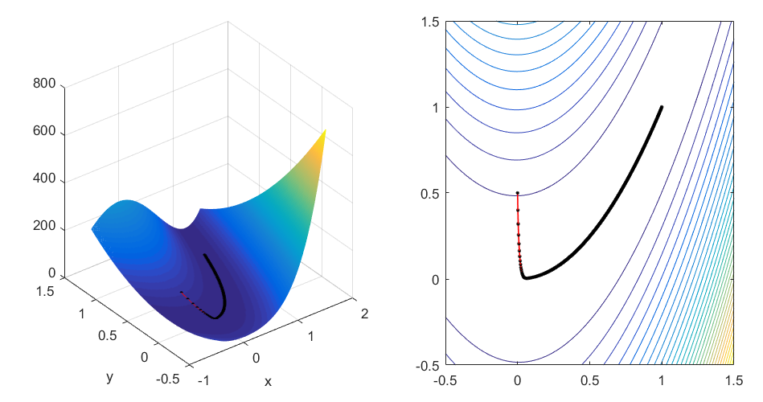
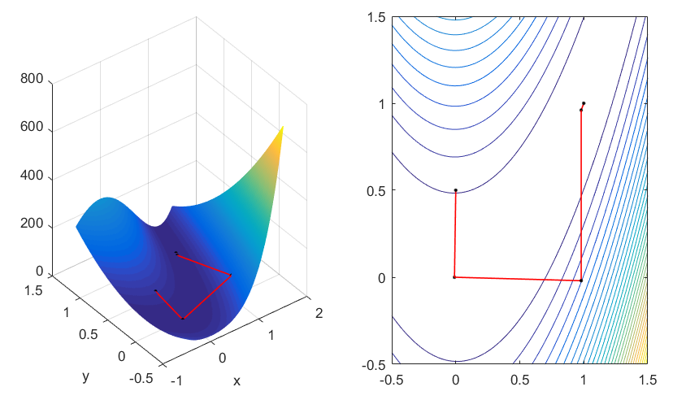

# ME5405-Neuron-Networks-Homework2
## 1.Perform steepest(graident) descent method and Newton's method with the Rosenbrock's Valley function:  
$f(x,y) = (1-x)^2+100(y-x^2)^2$  

## 2.Use MLP to do function approximation:sequential mode, batch mode(trainlm, trainbr)  
  

## 3.Use NN to do image classification  
  
(a) Use single layer perceptron do training and evaluate the performance. 
(b) Down sampling the images with "resize" and PCR method and evaluate the training and testing performance. 
  
(c) Apply MLP to the dataset and evaluate the training and testing performance 
